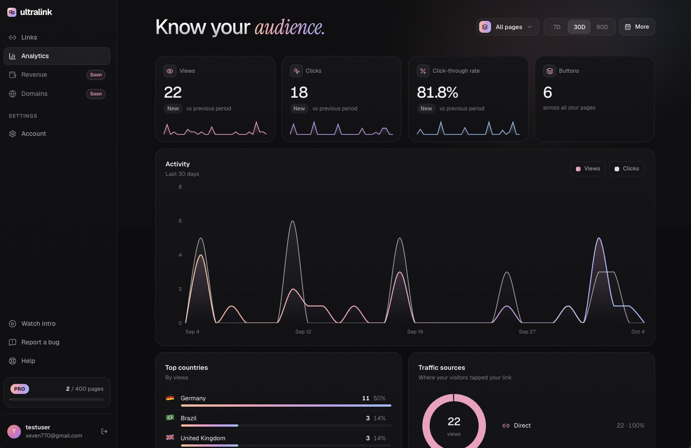

# 🔗 Ultralink

[](https://github.com/lvfranek/Ultralink/actions/workflows/ci.yml)

Ultralink is a website builder for creators and agencies —
build a fast, branded link page and see real analytics behind every click.




## Table of Contents

- [Tech Stack](#tech-stack)
- [Features](#features)
- [Live Demo](#live-demo)
- [Installation](#%EF%B8%8F-installation)
- [Environment Variables](#environment-variables)
- [Admin Panel](#admin-panel)
- [Available Scripts](#available-scripts)
- [Folder Structure](#folder-structure)
- [Tests](#tests)
- [Deployment](#deployment)
- [Security Considerations](#security-considerations)
- [Learn More](#learn-more)
- [License](#license)

## Tech Stack

| Area        | Choice                                                                                    |
| ----------- | ----------------------------------------------------------------------------------------- |
| Framework   | Next.js 16 (App Router)                                                                   |
| UI          | React 19 + React Compiler                                                                 |
| Language    | TypeScript                                                                                |
| Styling     | Tailwind CSS v4                                                                           |
| Database    | [Supabase](https://supabase.com) — Postgres, auth, storage                                |
| Payments    | [Stripe](https://stripe.com) — subscriptions + webhooks                                   |
| Email       | [Resend](https://resend.com)                                                              |
| Drag & drop | [dnd-kit](https://dndkit.com) — link reordering                                           |
| Charts      | [Recharts](https://recharts.org) — analytics dashboard                                    |
| Icons       | Lucide                                                                                    |
| Hosting     | Vercel                                                                                    |
| Testing     | [Vitest](https://vitest.dev) (unit/component), [Playwright](https://playwright.dev) (E2E) |
| CI          | GitHub Actions — lint, tests, build + Lighthouse on every push                            |

## Features

**On your page**

- **Unlimited links** — create as many link pages as your plan allows.
- **Simple or advanced** — easy for your first link, complex when you need it.
- **Conversion-ready designs** — pages tuned to convert, or styled to match your brand.
- **Quick pages** — pages load instantly, even on slow connections.
- **Deep linking** — your links open in the real browser, not a broken in-app one.

**Growth & control**

- **Real analytics** — clicks, CTR, countries, devices, time on page, and top links.
- **Win-Back** — offer leaving visitors a second link before they go.
- **Country blocking** — restrict your page to specific countries.
- **18+ age gate** — a clean, compliant age screen for mature content.
- **Active badge 🟢** — show a live "active now" badge to build trust.
- **Team access** — let your assistant create links and track data for you.

**In the dashboard**

- Link page builder with live preview (profile, links, socials, design, advanced tabs)
- Analytics with a date-range picker
- Revenue tracking and account/billing settings
- Admin panel for the site owner — see [Admin Panel](#admin-panel)

## Live Demo

[ultralink.bio](https://ultralink.bio)

## ⚙️ Installation

**Prerequisites:** Node.js 24+ (see [`.nvmrc`](.nvmrc)), a Supabase project, and Stripe/Resend accounts (test mode is fine).

1. **Clone and install**

   ```bash
   git clone https://github.com/lvfranek/Ultralink.git
   cd Ultralink
   npm install
   ```

2. **Set up the database.** In your Supabase project's SQL editor, run every file in
   [`supabase/migrations/`](supabase/migrations/) in filename order, then create a **public** bucket
   named `media` under Storage and run [`supabase/storage-policies.sql`](supabase/storage-policies.sql).

3. **Configure your environment**

   ```bash
   cp .env.example .env.local
   ```

   Fill in the values — see [Environment Variables](#environment-variables) below. `.env.example`
   documents where to find each one.

4. **Start the dev server**

   ```bash
   npm run dev
   ```

   Open [http://localhost:3000](http://localhost:3000).

5. _(Optional)_ **Forward Stripe webhooks locally** so subscription changes reach the app:
   ```bash
   stripe listen --forward-to localhost:3000/api/stripe/webhook
   ```

## Environment Variables

All variables are documented inline in [`.env.example`](.env.example). The groups are:

| Group         | Variables                                                                                              | Notes                                                                                                                                                                         |
| ------------- | ------------------------------------------------------------------------------------------------------ | ----------------------------------------------------------------------------------------------------------------------------------------------------------------------------- |
| Supabase      | `NEXT_PUBLIC_SUPABASE_URL`, `NEXT_PUBLIC_SUPABASE_ANON_KEY`, `SUPABASE_SERVICE_ROLE_KEY`               | The service role key must never reach the browser.                                                                                                                            |
| Site URL      | `NEXT_PUBLIC_SITE_URL`                                                                                 | Single source of truth for absolute URLs (Stripe redirects, sign-out, invite emails). **Must be set at build time** — it's inlined into the bundle.                           |
| Email         | `RESEND_API_KEY`                                                                                       | Needs "Sending" permission and a verified sending domain.                                                                                                                     |
| Stripe        | `STRIPE_SECRET_KEY`, `STRIPE_WEBHOOK_SECRET`                                                           | Use `sk_test_` keys in development.                                                                                                                                           |
| Stripe prices | `STRIPE_PRICE_<TIER>_MONTHLY` / `_ANNUAL`                                                              | One pair per tier (1, 3, 10, 25, 50, 100, 200, 400 link pages). Each price needs metadata `{ tier, interval }`. Annual is billed yearly at roughly a 25% discount.            |
| Admin         | `DISCORD_WEBHOOK_URL`, `DISCORD_BUGS_WEBHOOK_URL`, `DISCORD_FEATURES_WEBHOOK_URL`, `ADMIN_USER_ID`     | All optional. Discord notifications silently no-op when unset, so signup and payment flows never fail. `/admin` 404s for everyone but `ADMIN_USER_ID`.                        |
| Imprint       | `IMPRINT_NAME`, `IMPRINT_STREET`, `IMPRINT_CITY`, `IMPRINT_COUNTRY`, `IMPRINT_PHONE`, `IMPRINT_VAT_ID` | Server-only — powers `/imprint` and the Privacy Policy's controller address. Unset in a fresh clone, so those pages show a "not configured" notice instead of a real address. |

Never commit `.env.local`.

## Admin Panel

A private business overview at **`/admin`**, for the site owner only.

**Access.** Only the account whose user ID matches `ADMIN_USER_ID` can open it. Everyone else —
including signed-out visitors — gets a regular 404, so the page's existence isn't revealed. It isn't
linked in the sidebar; open `/admin` directly. Find your user ID in Supabase under
**Authentication → Users**.

**What it shows**

- **Key numbers** — total users, Pro users (with conversion rate), free users, MRR with estimated
  ARR, and subscription health (accounts in the payment grace period and canceled accounts).
- **Tier distribution** — for each plan tier: monthly vs. annual customers, total, and MRR.
- **Recent signups** — the last 7 days, with each user's plan.

The admin account is excluded from revenue and conversion numbers, so giving yourself Pro doesn't
inflate MRR.

**Discord notifications** complement the panel (all optional, see [Environment Variables](#environment-variables)):
new signups (email or Google), new Pro subscriptions with updated MRR, cancellations, and bug
reports / feature requests from the in-app feedback form.

## Available Scripts

| Command                | What it does                                                            |
| ---------------------- | ----------------------------------------------------------------------- |
| `npm run dev`          | Start the Next.js dev server                                            |
| `npm run build`        | Production build                                                        |
| `npm run start`        | Serve the production build                                              |
| `npm run lint`         | Run ESLint over the project                                             |
| `npm run typecheck`    | Run the TypeScript compiler                                             |
| `npm run format`       | Format the whole repo with Prettier                                     |
| `npm run format:check` | Check formatting without writing                                        |
| `npm test`             | Run the unit/component tests once (Vitest)                              |
| `npm run test:watch`   | Re-run tests on every file change                                       |
| `npm run test:e2e`     | Run the end-to-end tests (Playwright, needs a production build running) |

## Folder Structure

```
src/
  app/
    (marketing)/          Landing page, help center, privacy, terms, imprint
    (auth)/                Login, auth callback + email confirm
    (dashboard)/
      dashboard/           Links, analytics, revenue, account (+ domains placeholder)
      admin/                Admin-only overview (gated by ADMIN_USER_ID)
    [slug]/                 Public link pages (+ blocked state)
    r/[link_id]/           Click-tracking redirect route
    checkout/                Stripe Checkout entry point
    invite/accept/           Team invite acceptance
    actions/                 Server actions (links, pages, billing, team, analytics, …)
    api/
      stripe/webhook/       Stripe subscription webhook handler
      track/winback/        Win-Back interaction tracking
      account/delete/       Account deletion
      auth/signout/
    sitemap.ts, robots.ts, opengraph-image.tsx, not-found.tsx
  components/
    marketing/              Hero, features, pricing, FAQ, help center
    dashboard/               Shell, sidebar, modals, page-builder/
    public/                  Public page view, age gate, win-back overlay, social icons
    ui/
  lib/                       Business logic, with unit tests next to it (*.test.ts)
    supabase/                Browser, server, and service-role clients + types
    stripe/                  Stripe server client + price/tier mapping
    analytics/               Analytics helpers
    notifications/           Discord webhooks
    rate-limit.ts, db-error.ts, legal.ts
e2e/                         Playwright end-to-end tests
supabase/
  migrations/                Schema migrations (run in filename order)
  storage-policies.sql       Policies for the public `media` bucket
.github/workflows/ci.yml     CI: lint, tests, build + Lighthouse audit
lighthouserc.json            Lighthouse CI pages and score limits
```

## Tests

**Unit and component tests** ([Vitest](https://vitest.dev)) cover the core business logic — the code
where a silent mistake costs money or data — plus a few key UI components:

- **Billing** — who counts as Pro, grace periods, link limits per plan, MRR math, and a consistency
  check of the pricing table (annual is always cheaper, prices add up).
- **Analytics** — device detection (phone, tablet, desktop, bots and link previews) and referrer cleanup.
- **Input handling** — URL normalization (`youtube.com` → `https://youtube.com`, no `javascript:` links),
  page-slug rules and reserved names, rate limiting.
- **Themes** — broken or outdated saved designs fall back to safe defaults instead of crashing.
- **Components** — the FAQ accordion, the pricing card, and the Win-Back popup preview.

Tests live next to the code they test (`*.test.ts` / `*.test.tsx`) and need no database or API keys.

```bash
npm test              # unit + component tests, once
npm run test:watch    # re-run on every save
npm run test:e2e       # end-to-end tests (builds + serves the app first)
```

**End-to-end tests** ([Playwright](https://playwright.dev)) drive a real Chromium browser against a
production build: keyboard navigation, the FAQ, the mobile menu, sign-in validation, and access
control on the dashboard.

**Continuous integration.** Every push to `main` and every pull request runs two jobs in
[`.github/workflows/ci.yml`](.github/workflows/ci.yml): lint → typecheck → unit tests → build, and
(in parallel) E2E tests → a Lighthouse audit. Neither needs secrets. The badge at the top of this
README shows the current status.

**Linting & formatting.** ESLint (Next.js + React Hooks rules) and Prettier, both at zero
errors/warnings across the repo. The few intentional ESLint exceptions (code that must read
browser-only APIs like `localStorage` after the page loads) are disabled line by line, each with a
comment explaining why.

**Accessibility & Lighthouse.** All public pages score 100 for accessibility in Lighthouse:
sufficient color contrast, labeled controls, a "Skip to main content" link, visible focus rings, and
a logical Tab order on desktop and mobile. [Lighthouse CI](https://github.com/GoogleChrome/lighthouse-ci)
enforces this on every push and fails if accessibility drops below 100, or best practices / SEO below
90 ([`lighthouserc.json`](lighthouserc.json)); performance is reported as a warning only, since shared
CI machines give noisy timings. Full reports are attached to each CI run as a downloadable artifact.

## Deployment

The reference deployment runs on [Vercel](https://vercel.com), connected to this GitHub repo.

1. Import the repository into Vercel.
2. Add every variable from `.env.example` (plus the Imprint variables, see
   [Environment Variables](#environment-variables)) under **Project Settings → Environment Variables**.
   Set `NEXT_PUBLIC_SITE_URL` to your production URL _before_ the first build — it's inlined at build
   time, not read at runtime.
3. Create a Stripe webhook pointing at `https://<your-domain>/api/stripe/webhook`, subscribed to:
   - `checkout.session.completed`
   - `customer.subscription.created`
   - `customer.subscription.updated`
   - `customer.subscription.deleted`
   - `invoice.payment_failed`
   - `invoice.payment_succeeded`

   Copy its signing secret into `STRIPE_WEBHOOK_SECRET`.

4. Deploy. Pushes to the default branch redeploy automatically.

## Security Considerations

- **Row Level Security** on every table, with column-level write grants on `profiles` — a signed-in
  user can update their own username/display name, but not their own subscription status or billing
  fields; only the server (Stripe webhook, billing actions) can write those.
- **Plan limits enforced in the database, not just the app** — a Postgres trigger blocks a page insert
  once an owner is at their plan's link cap, so the limit can't be bypassed by calling the Supabase
  API directly instead of going through the app.
- **No raw database errors reach the client.** Unexpected Postgres/PostgREST errors are logged
  server-side and replaced with a generic message before being returned — never table, column, or
  constraint names.
- **Best-effort rate limiting** on public endpoints not already covered by Supabase Auth's own limits
  (checking a slug's availability, resending a confirmation email, the Win-Back tracking endpoint).
  In-memory per server instance — a real speed bump against casual abuse and simple bots, not a hard
  guarantee on serverless hosting.
- **Security headers** (`next.config.ts`): a restrictive CSP, `X-Frame-Options: DENY`,
  `X-Content-Type-Options: nosniff`, `Referrer-Policy`, `Permissions-Policy`, and
  `Cross-Origin-Opener-Policy`.
- **Open-redirect protection** on the auth callback — the post-login `?next=` destination is validated
  to be a same-site path before redirecting.
- **Account deletion cancels billing first.** Deleting an account cancels the Stripe subscription
  before removing the user, so no account keeps getting charged after it's gone.
- `npm audit`: 0 vulnerabilities.

## Learn More

- [Next.js documentation](https://nextjs.org/docs)
- [Supabase documentation](https://supabase.com/docs)
- [Stripe documentation](https://docs.stripe.com)
- [Resend documentation](https://resend.com/docs)

## License

All rights reserved — see [LICENSE](LICENSE).
